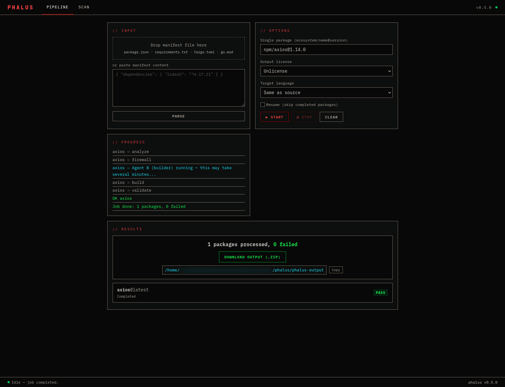

# phalus

**Private Headless Automated License Uncoupling System** — a self-hosted tool for AI-powered clean room software reimplementation. Feed it a dependency manifest and it runs a two-phase, isolation-enforced LLM pipeline: Agent A reads only public documentation and produces a formal specification, Agent B reads only that specification and implements the package from scratch.

No user accounts. No payments. No SaaS. You run it on your own machine with your own API keys.



## Install

### From crates.io

```sh
cargo install phalus
```

### Download binary

Pre-built binaries for Linux (x86_64, aarch64), macOS (Apple Silicon), and Windows are available from [GitHub Releases](https://github.com/phalus-sh/phalus/releases).

```sh
# Linux (x86_64)
curl -L https://github.com/phalus-sh/phalus/releases/latest/download/phalus-v0.1.0-x86_64-unknown-linux-gnu.tar.gz | tar xz
sudo mv phalus /usr/local/bin/

# macOS (Apple Silicon)
curl -L https://github.com/phalus-sh/phalus/releases/latest/download/phalus-v0.1.0-aarch64-apple-darwin.tar.gz | tar xz
sudo mv phalus /usr/local/bin/
```

### Docker

```sh
docker run -p 3000:3000 \
  -e PHALUS_LLM__AGENT_A_API_KEY=sk-ant-... \
  -e PHALUS_LLM__AGENT_B_API_KEY=sk-ant-... \
  ghcr.io/phalus-sh/phalus:latest
```

### Build from source

```sh
git clone https://github.com/phalus-sh/phalus.git
cd phalus && cargo build --release -j2
```

## Quick Start

Set your API keys:

```sh
export PHALUS_LLM__AGENT_A_API_KEY=sk-ant-...
export PHALUS_LLM__AGENT_B_API_KEY=sk-ant-...
```

Preview what would be processed:

```sh
phalus plan package.json
```

Run a single package through the full pipeline:

```sh
phalus run-one npm/left-pad@1.1.3 --license mit
```

Run all packages in a manifest:

```sh
phalus run package.json --license apache-2.0 --output ./reimplemented
```

Dry run (Agent A only, produce specs without implementation):

```sh
phalus run package.json --dry-run
```

Cross-language reimplementation:

```sh
phalus run package.json --license mit --target-lang rust
```

Inspect results:

```sh
phalus inspect ./phalus-output --audit
phalus inspect ./phalus-output --similarity
phalus inspect ./phalus-output --csp
```

Re-validate existing output:

```sh
phalus validate ./phalus-output --similarity-threshold 0.5
```

## Supported Ecosystems

| Ecosystem | Manifest | Registry |
|-----------|----------|----------|
| npm | `package.json` | registry.npmjs.org |
| Python | `requirements.txt` | pypi.org |
| Rust | `Cargo.toml` | crates.io |
| Go | `go.mod` | proxy.golang.org |

## How It Works

```
Manifest → Registry Resolver → Doc Fetcher → Agent A (Analyzer)
    → Isolation Firewall → Agent B (Builder) → Validator → Output
```

1. **Agent A** reads only public documentation (README, API docs, type definitions) and produces a Clean Room Specification Pack (CSP) — 10 documents describing what the package does, never how.
2. The **Isolation Firewall** enforces separation: Agent B never sees the original documentation or source code. Only the CSP crosses the boundary, logged with SHA-256 checksums.
3. **Agent B** reads only the CSP and implements the package from scratch under your chosen license.
4. The **Validator** checks syntax, runs tests, scores similarity against the original, and flags anything above threshold.

Every step is recorded in an append-only audit trail.

## Configuration

`~/.phalus/config.toml`:

```toml
[llm]
agent_a_provider = "anthropic"
agent_a_model = "claude-sonnet-4-6"
agent_a_api_key = ""
agent_b_provider = "anthropic"
agent_b_model = "claude-sonnet-4-6"
agent_b_api_key = ""

[isolation]
mode = "context"    # context | process | container

[limits]
max_packages_per_job = 50
max_package_size_mb = 10
concurrency = 3

[validation]
similarity_threshold = 0.70
run_tests = true
syntax_check = true

[output]
default_license = "mit"
output_dir = "./phalus-output"
include_csp = true
include_audit = true

[web]
enabled = false
host = "127.0.0.1"
port = 3000

[doc_fetcher]
max_readme_size_kb = 500
max_code_example_lines = 10
github_token = ""
```

All config keys can be overridden via environment variables with `PHALUS_` prefix and double-underscore nesting:

```sh
PHALUS_LLM__AGENT_A_API_KEY=sk-ant-...
PHALUS_LLM__AGENT_A_MODEL=claude-sonnet-4-6
PHALUS_ISOLATION__MODE=process
PHALUS_WEB__ENABLED=true
```

## Output Licenses

| License | ID |
|---------|----|
| MIT | `mit` |
| Apache 2.0 | `apache-2.0` |
| BSD 2-Clause | `bsd-2` |
| BSD 3-Clause | `bsd-3` |
| ISC | `isc` |
| Unlicense | `unlicense` |
| CC0 1.0 | `cc0` |

## Web UI

Enable the optional local web UI:

```sh
PHALUS_WEB__ENABLED=true phalus run package.json
```

Or set `web.enabled = true` in config.toml. Serves on `http://127.0.0.1:3000` by default.

## Ethical Notice

This tool raises serious ethical and legal questions about open source sustainability. It exists for research, education, and transparent discourse — not to encourage license evasion. You are responsible for understanding the legal implications in your jurisdiction. The legality of AI-assisted clean room reimplementation is unsettled law.

## Background

This project replicates the core pipeline demonstrated by [Malus](https://malus.sh/), presented at FOSDEM 2026 by Dylan Ayrey and Mike Nolan. PHALUS strips the concept down to the essential machinery: the pipeline, the isolation, and the audit trail.

## License

0BSD
