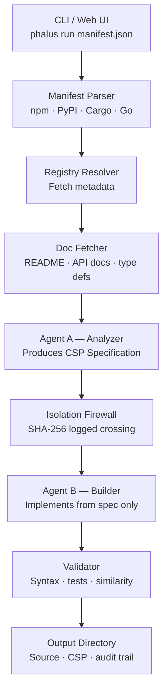

# PHALUS

**Private Headless Automated License Uncoupling System**

PHALUS is a self-hosted, single-operator tool for AI-powered clean room software reimplementation. Feed it a dependency manifest and it runs a two-phase, isolation-enforced pipeline: one agent reads only public documentation and produces a formal specification; a second agent, in a completely separate context, reads only that specification and implements the package from scratch. The output is functionally equivalent code under whatever license you choose, with a full audit trail.

No accounts. No payments. No SaaS. Your machine, your API keys, your output.

---

## Key Features

<div class="grid cards" markdown>

- **Two-agent isolation**

    Agent A (Analyzer) reads public documentation only. Agent B (Builder) reads the specification only. The two agents never share context.

- **Full audit trail**

    Every pipeline step is recorded in an append-only JSONL file with SHA-256 checksums. The entire log is hashed on completion for tamper detection.

- **Multi-ecosystem**

    Parse `package.json`, `requirements.txt`, `Cargo.toml`, and `go.mod`. npm, PyPI, crates.io, and Go module proxy are all supported today.

- **Flexible output**

    Choose any permissive license for the generated code. Optionally reimplement in a different language to maximise structural divergence from the original.

- **License scanning**

    Scan projects for dependency licenses before reimplementing. Reads manifests and SBOMs (CycloneDX, SPDX), resolves licenses from registries, normalizes to SPDX identifiers, and classifies risk.

- **Multi-provider LLM support**

    Use Anthropic, OpenAI, OpenRouter, Ollama, vLLM, or any OpenAI-compatible endpoint. Each agent can use a different provider and model independently.

- **CSP caching**

    The Clean Room Specification Pack produced by Agent A is cached by content hash. Repeated runs on unchanged packages skip Agent A entirely.

- **Local web UI**

    An optional browser-based interface for manifest upload, live progress monitoring via Server-Sent Events, and output download.

</div>

---

## Architecture



---

## Quick Install

**From crates.io:**

```bash
cargo install phalus
```

**Pre-built binary** — download from the [releases page](https://github.com/phalus-sh/phalus/releases) and place on your `PATH`.

**Docker:**

```bash
docker pull ghcr.io/phalus-sh/phalus:latest
docker run --rm -v "$PWD":/work -w /work ghcr.io/phalus-sh/phalus run package.json
```

---

## Next Steps

[Get started](getting-started.md){ .md-button .md-button--primary }
[Pipeline explained](pipeline.md){ .md-button }
[CLI reference](cli-reference.md){ .md-button }
[Cookbook](cookbook.md){ .md-button }
