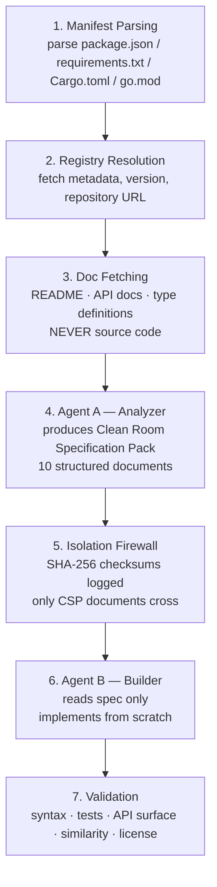

# Pipeline

PHALUS processes each package through seven sequential stages. The legal weight of the clean room claim rests on the integrity of this pipeline — specifically the isolation between stages 4 and 6 — and on the completeness of the audit trail produced at every boundary.

---

## Overview



---

## Stage 1: Manifest Parsing

PHALUS reads the project manifest and extracts the dependency list. Each entry becomes a `PackageRef` with a name, version constraint, and ecosystem tag.

Supported manifest formats:

| Ecosystem | File |
|-----------|------|
| npm | `package.json` |
| Python | `requirements.txt`, `pyproject.toml` |
| Rust | `Cargo.toml` |
| Go | `go.mod` |

Planned (not yet implemented): `pom.xml` (Java/Maven), `Gemfile` (Ruby), `composer.json` (PHP), `*.csproj` (.NET).

The `--only` and `--exclude` flags filter the package list before any network calls are made. The `plan` command stops after this stage and displays the filtered list.

An audit event (`manifest_parsed`) records the SHA-256 hash of the manifest file and the total package count.

---

## Stage 2: Registry Resolution

For each `PackageRef`, PHALUS calls the appropriate registry API to resolve full metadata:

- Package name and resolved version
- Description
- Original license
- Repository URL (used in stage 3)
- Homepage / docs URL (used in stage 3)

| Registry | Endpoint example |
|----------|-----------------|
| npm | `https://registry.npmjs.org/{name}/{version}` |
| PyPI | `https://pypi.org/pypi/{name}/{version}/json` |
| crates.io | `https://crates.io/api/v1/crates/{name}/{version}` |
| Go module proxy | `https://proxy.golang.org/{module}/@v/{version}.info` |

---

## Stage 3: Doc Fetching

The doc fetcher retrieves human-readable documentation for Agent A. This stage operates under a hard constraint: **source code files are never fetched**.

**Allowed inputs:**

- `README.md` / `README.rst` from the repository root (via GitHub API)
- Published documentation site at the package homepage URL
- TypeScript type definition files (`.d.ts`) from DefinitelyTyped or the package tarball
- Package registry description and metadata

**Blocked at all times (source guard — not configurable):**

Any file matching a source extension (`.js`, `.ts`, `.py`, `.rs`, `.go`, `.java`, `.rb`, `.php`, `.c`, `.cpp`, etc.) is rejected. If such a file is encountered and blocked, a `source_code_blocked` audit event is written recording the path and reason. The clean room claim depends on this filter being unconditional.

**Code example stripping:**

Inline code examples longer than the configured limit (`doc_fetcher.max_code_example_lines`, default 10) are stripped before being passed to Agent A. Short API usage examples that demonstrate the public interface are acceptable; lengthy implementation examples are not.

For npm packages, type definitions are also fetched from DefinitelyTyped when available.

All fetched documents are content-hashed. A `docs_fetched` audit event records the URLs accessed and the SHA-256 hash of each document.

---

## Stage 4: Agent A — Analyzer

Agent A receives only the fetched documentation. It produces a **Clean Room Specification Pack (CSP)**: ten structured documents that describe the package's public API and behaviour without revealing or inferring implementation details.

### CSP Documents

| # | Filename | Contents |
|---|----------|----------|
| 1 | `01-overview.json` | Package purpose, scope, target use cases |
| 2 | `02-api-surface.json` | Complete public API: function signatures, types, return types |
| 3 | `03-behavior-spec.json` | Detailed behavioural specification per public function |
| 4 | `04-edge-cases.json` | Documented edge cases, error conditions, boundary behaviour |
| 5 | `05-configuration.json` | Options, defaults, environment variables |
| 6 | `06-type-definitions.json` | TypeScript-style type definitions for the public API |
| 7 | `07-error-catalog.json` | Error types, messages, codes |
| 8 | `08-compatibility-notes.json` | Platform requirements, runtime compatibility, version notes |
| 9 | `09-test-scenarios.json` | Black-box test cases derived from documentation |
| 10 | `10-metadata.json` | Original package name, version, license, analysis timestamp |

Agent A's system prompt instructs it to describe *what* functions do, not *how* they work internally. It must not copy inline code examples from the documentation.

Each CSP document is content-hashed. A `spec_generated` audit event records the document hashes, the model identifier, and a SHA-256 hash of the prompt.

### CSP Caching

If the same package at the same version with the same documentation content hash has been analyzed before, the cached CSP is reused and a `spec_cache_hit` audit event is written. Agent B always runs fresh because independent generation is part of the clean room claim.

The cache lives at `~/.phalus/cache/csp/`.

---

## Stage 5: Isolation Firewall

The firewall is the legal and architectural core of the clean room methodology. It enforces that Agent B never receives:

- Agent A's raw inputs (the documentation)
- The original package source code
- Any intermediate state from Agent A's reasoning
- The original package's repository URL or any link back to it

**Only the CSP documents cross the firewall.**

Every crossing is logged as a `firewall_crossing` audit event containing:

- The list of documents transferred by filename
- A SHA-256 checksum for each document
- The isolation mode in use
- An explicit `source_code_accessed: false` assertion

### Isolation Modes

| Mode | Description |
|------|-------------|
| `context` | Agent A and Agent B are separate LLM API calls with independent conversation contexts. Default. |
| `process` | Agent A and Agent B run in separate OS processes with no shared memory. |
| `container` | Agent A and Agent B run in isolated Docker containers with no network overlap. |

The isolation mode is set via `--isolation` on the CLI or `isolation.mode` in `config.toml`.

---

## Stage 6: Agent B — Builder

Agent B receives only the CSP documents. Its system prompt makes clear that it has never seen the original source code or documentation — only the specification.

Agent B is instructed to:

- Implement every function, class, and method in the API surface
- Match the behavioural specification exactly
- Handle all documented edge cases
- Write the test scenarios from the CSP as runnable tests
- Use idiomatic code for the target language
- Add the specified license header to every source file

Agent B is explicitly free to choose any internal implementation approach. The specification describes *what* the code must do, not *how*.

If `--target-lang` is specified, Agent B receives an additional instruction to implement in the target language (e.g. Rust, Go, Python, TypeScript) rather than the original package's language. This forces structural divergence because the language itself changes the implementation shape.

An `implementation_generated` audit event records the SHA-256 hash of every generated file and the prompt hash.

---

## Stage 7: Validation

After Agent B writes the output files, the validator runs a suite of checks:

| Check | What it verifies |
|-------|-----------------|
| Syntax | Generated code parses without errors for the target language |
| Tests | Generated tests (from CSP `09-test-scenarios.json`) are executed; pass/fail counts recorded |
| API surface | All exports listed in `02-api-surface.json` are present in the generated code |
| License | Correct license header present on all source files; `LICENSE` file present |
| Similarity | Token similarity, function-name overlap, and string overlap against the original source are computed |

The similarity check fetches the original package source code **for the validator only** — it is never shown to Agent A or Agent B. This fetch is recorded in an `original_source_fetched` audit event.

**Similarity metrics:**

| Metric | Description |
|--------|-------------|
| `token_similarity` | Jaccard similarity of token sets |
| `name_overlap` | Fraction of function names shared (expected to be high — public API names must match) |
| `string_overlap` | Overlap of string literals |
| `overall_score` | Combined score used for the threshold check |

The verdict is `PASS` if `overall_score` is at or below the configured `similarity_threshold` (default 0.70) **and** the license check passes **and** the syntax check passes.

A `validation_completed` audit event records all scores and the verdict. The full report is written to `<output-dir>/<package>/validation.json`.

---

## Split Pipeline

The pipeline can be split into two independent steps, allowing human review or programmatic modification of the CSP between Agent A and Agent B:

1. **`--dry-run`** runs stages 1–5 (manifest parsing through firewall crossing) and writes the CSP to disk. Agent B is not invoked.
2. **`phalus build`** runs stage 6 (Agent B) from an existing CSP on disk, without re-running Agent A.

This split is useful for:

- **Reviewing specifications** before committing to code generation
- **Injecting custom constraints** (e.g. security requirements) into the CSP documents
- **Reusing a single CSP** to generate implementations in multiple languages
- **CI/CD pipelines** where spec generation and code generation are separate stages

```bash
# Stage 1-5: Generate CSP only
phalus run-one npm/lodash@4.17.21 --dry-run

# (optional) Modify the CSP
$EDITOR ./phalus-output/lodash/.cleanroom/csp/03-behavior-spec.json

# Stage 6: Build from CSP
phalus build ./phalus-output/lodash/.cleanroom/csp/
```

The CSP is a set of JSON files stored at `<output>/<package>/.cleanroom/csp/`. The `manifest.json` file in that directory is the machine-readable index that `phalus build` reads. You can modify either the individual files or the `manifest.json` directly.

See the [Cookbook](cookbook.md) for detailed examples including programmatic CSP modification with `jq` and Python.

---

## Concurrency

When processing a manifest with multiple packages, PHALUS runs up to `concurrency` packages in parallel (default 3). Each package runs the complete 7-stage pipeline independently. The audit logger is shared across parallel tasks using a mutex.

Concurrency is controlled via `--concurrency` on the CLI or `limits.concurrency` in `config.toml`.
